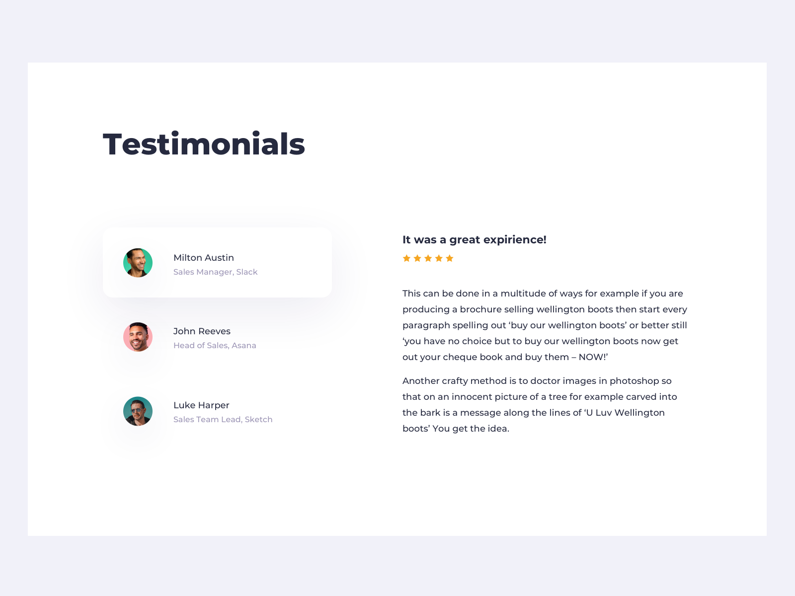

# The Custom Testimonial Every Website Should Use

The most proactive way of building a web markup is my rendering the right tags, adding the right attributes for styling and finally, commenting when you have various sections. 

In this tutorial, we will explore practical example with a Testimonial Page. 

## HTML
*While HTML might seem simple for people who have been into it for long, it can be daunting and confusing for beginners.*   

*In this video, I was able to break down the exact way you should solve the project puzzle whenever it comes to handling HTML in your next project.* 

## CSS 
Cascading Style Sheet (CSS) is robust; without it, the web will seem naked. CSS was used to add flesh and clothing to our testimonial web page.   

We used the CSS class selector to target each element on the page and apply unique CSS declarations to them. 

## Javascript Logic
*[Event bubbling](https://javascript.info/bubbling-and-capturing) and event capturing was used to capture clicks whenever the user clicks on the button. Which also allows us to manipulate the [parent element](https://www.w3schools.com/jsref/prop_node_parentelement.asp).*

* We create a `ForEach` loop and added event handler on the `user_meta` div. 
* We used the `if` statement to check which button was click and attached the open class to the `parentElement` 

## Credit: 
* Created By [InstinctHub](https://instincthub.com/)
* UI Design By [Olga Chernenka](https://dribbble.com/shots/10464678-Daily-UI-039-Testimonials)
* HTML Entity By [Toptal](https://www.toptal.com/designers/htmlarrows/)
* Dummy Text By [Lorem Ipsum](https://www.lipsum.com)

## Planned Markup 

